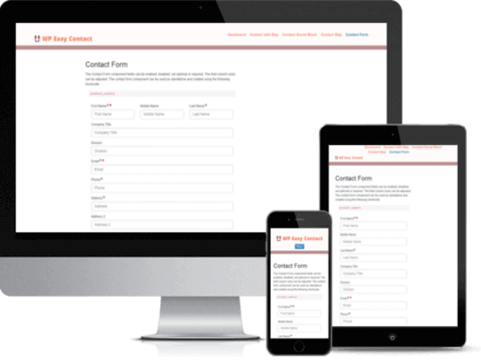

<!-- PROJECT LOGO -->
 

  

  <h3 align="center">WP Easy Contact</h3>

  

    Best Contact Management Software for WordPress
     
     
     <a href="https://github.com/emarket-design/wp-easy-contact/issues">Report Bug</a>
    ·
    <a href="https://github.com/emarket-design/wp-easy-contact/issues">Request Feature</a>
     

<!-- ABOUT THE PROJECT -->
## About The Project

<ul>
<li>Manage all contact information and communication activities in a centralized location</li>
<li>Create, track, and report on tasks related to your contacts</li>
<li>Customizable contact form with map and social link blocks</li>
<li>Search through contacts with advanced static and dynamic filters</li>
<li>Create advanced exportable reports and contact segments</li>
<li>All device friendly, bring-your-own-theme interface</li>
<li>Ability create contacts through emails (extension sold separately)</li>
</ul>

### Related WordPress Plugins

* [Knowledge Center Starter](https://kcentercom.emdplugins.com/) Great knowledge base software for helping your customers and employees to find answers faster.
* [Software Issue Manager Starter](https://simcom.emdplugins.com/) The best in class issue and project management solution for successful projects.
* [Request a quote Starter](https://requestaquote.emdplugins.com/) The Best Sales Quoting software for WordPress.
* [Employee Spotlight Starter](https://espotlight-com.emdplugins.com) Everything you need to display and manage staff profiles.
* [WP Ticket Starter](https://wpticketcom.emdplugins.com/) Powerful customer support and helpdesk ticketing system.
* [Employee Directory Starter](https://employee-directory-com.emdplugins.com) The most complete employee directory software to power up your business.

### Features

* [Powerful spam protection system.](https://emdplugins.com/?p=10512&pk_campaign=wp-easy-contact-com&pk_kwd=github)
* [Add additional fields to your contact management database using EMD Custom Field Builder.](https://emdplugins.com/?p=10513&pk_campaign=wp-easy-contact-com&pk_kwd=github)
* [Centralize all your contacts in one location to minimize conflicts, dupes or errors.](https://emdplugins.com/?p=10509&pk_campaign=wp-easy-contact-com&pk_kwd=github)
* [Fully customize your contact form from the plugin settings.](https://emdplugins.com/?p=10511&pk_campaign=wp-easy-contact-com&pk_kwd=github)
* [Allow submissions from any device any time.](https://emdplugins.com/?p=10510&pk_campaign=wp-easy-contact-com&pk_kwd=github)
* [Categorize and group contacts to  better qualify them.](https://emdplugins.com/?p=10514&pk_campaign=wp-easy-contact-com&pk_kwd=github)
* [Display recent contacts on your sidebar.](https://emdplugins.com/?p=10515&pk_campaign=wp-easy-contact-com&pk_kwd=github)
* [Powerful contact management dashboard.](https://emdplugins.com/?p=10517&pk_campaign=wp-easy-contact-com&pk_kwd=github) - Premium feature (included in Pro)
* [Allow contacts to upload files with ease.](https://emdplugins.com/?p=10525&pk_campaign=wp-easy-contact-com&pk_kwd=github) - Premium feature (included in Pro)
* [Customize with ease.](https://emdplugins.com/?p=10521&pk_campaign=wp-easy-contact-com&pk_kwd=github) - Premium feature (included in Pro)
* [Create relationships between contacts.](https://emdplugins.com/?p=10519&pk_campaign=wp-easy-contact-com&pk_kwd=github) - Premium feature (included in Pro)
* [Ask contacts to accept your terms and conditions before submission.](https://emdplugins.com/?p=10524&pk_campaign=wp-easy-contact-com&pk_kwd=github) - Premium feature (included in Pro)
* [Create and assign tasks to your team.](https://emdplugins.com/?p=10516&pk_campaign=wp-easy-contact-com&pk_kwd=github) - Premium feature (included in Pro)
* [Contact manager role to manage contact lists.](https://emdplugins.com/?p=10639&pk_campaign=wp-easy-contact-com&pk_kwd=github) - Premium feature (included in Pro)
* [Display your social media links in the contact form.](https://emdplugins.com/?p=10523&pk_campaign=wp-easy-contact-com&pk_kwd=github) - Premium feature (included in Pro)
* [See completed tasks on your sidebar.](https://emdplugins.com/?p=10526&pk_campaign=wp-easy-contact-com&pk_kwd=github) - Premium feature (included in Pro)
* [Powerful notification system for you and contacts.](https://emdplugins.com/?p=10518&pk_campaign=wp-easy-contact-com&pk_kwd=github) - Premium feature (included in Pro)
* [Google map field to display your  location on the contact form.](https://emdplugins.com/?p=10522&pk_campaign=wp-easy-contact-com&pk_kwd=github) - Premium feature (included in Pro)
* [Expand what contact managers can do from plugin settings.](https://emdplugins.com/?p=10989&pk_campaign=wp-easy-contact-com&pk_kwd=github) - Premium feature (included in Pro)
* [Create contact records from the incoming emails.](https://emdplugins.com/?p=10531&pk_campaign=wp-easy-contact-com&pk_kwd=github) - Add-on
* [Add contacts to your MailChimp list automatically.](https://emdplugins.com/?p=10641&pk_campaign=wp-easy-contact-com&pk_kwd=github) - Add-on
* [Powerful import, export and update contact lists from or to CSV.](https://emdplugins.com/?p=10529&pk_campaign=wp-easy-contact-com&pk_kwd=github) - Add-on (included in Pro)
* [Search contacts, create segments and export the results to PDF or CSV in WordPress Dashboard.](https://emdplugins.com/?p=10640&pk_campaign=wp-easy-contact-com&pk_kwd=github) - Add-on (included in Pro)

<!-- GETTING STARTED -->
## Getting Started

### Watch Introduction Video 

 

To get a local copy up and running follow these simple example steps.

### WP Easy Contact WordPress Plugin Links

 * [WP Easy Contact Starter Demo Site](https://wpeasycontactcom.emdplugins.com?pk_campaign=wp-easy-contact-com&pk_kwd=readme)
* [WP Easy Contact Starter Documentation](https://docs.emdplugins.com/wp-easy-contact-community/?pk_campaign=wp-easy-contact-com&pk_kwd=readme)
* [WP Easy Contact Professional Demo Site](https://wpeasycontact.emdplugins.com/?pk_campaign=wp-easy-contact-com&pk_kwd=readme)
* [WP Easy Contact Professional Documentation](https://docs.emdplugins.com/wp-easy-contact-professional/?pk_campaign=wp-easy-contact-com&pk_kwd=readme)
* [WP Easy Contact Professional Changes](https://emdplugins.com/articles/wp-econtact-pro-wordpress-plugin-changelog/?pk_campaign=wp-easy-contact-com&pk_kwd=readme)

### Installation

#### Using This Page
* Click on Clone or Download button on this page. Click, and you can see a drop-down box having two options, click on Download ZIP.
* Login to your website and go to the Plugins section of your admin panel.
* Click the Add New button.
* Under Install Plugins, click the Upload link.
* Select the plugin zip file from your computer then click the Install Now button.
* You should see a message stating that the plugin was installed successfully.
* Click the Activate Plugin link.

#### Using WordPress

The simplest way to install is to click on WordPress 'Plugins' page then 'Add' and type 'WP Easy Contact' in the search field.

##### Manual Installation Type 1

* Login to your website and go to the Plugins section of your admin panel.
* Click the Add New button.
* Under Install Plugins, click the Upload link.
* Select the plugin zip file from your computer then click the Install Now button.
* You should see a message stating that the plugin was installed successfully.
* Click the Activate Plugin link.

##### Manual Installation Type 2

* You should have access to the server where WordPress is installed. If you don't, see your system administrator.
* Copy the plugin zip file up to your server and unzip it somewhere on the file system.
* Copy the "wp-easy-contact" folder into the /wp-content/plugins directory of your WordPress installation.
* Login to your website and go to the Plugins section of your admin panel.
* Look for "WP Easy Contact" and click Activate.

<!-- CONTRIBUTING -->
## Contributing

Contributions are what make the open source community such an amazing place to learn, inspire, and create. Any contributions you make are **greatly appreciated**.

1. Fork the Project
2. Create your Feature Branch (`git checkout -b feature/AmazingFeature`)
3. Commit your Changes (`git commit -m 'Add some AmazingFeature'`)
4. Push to the Branch (`git push origin feature/AmazingFeature`)
5. Open a Pull Request

<!-- LICENSE -->
## License

Distributed under the GPLv2 or later License. See [`LICENSE`](https://www.gnu.org/licenses/gpl-2.0.html) for more information.

<!-- CONTACT -->
## MORE INFO

[WP Easy Contact](https://emdplugins.com/plugins/wp-easy-contact-wordpress-plugin/) - WORDPRESS PLUGIN PAGE